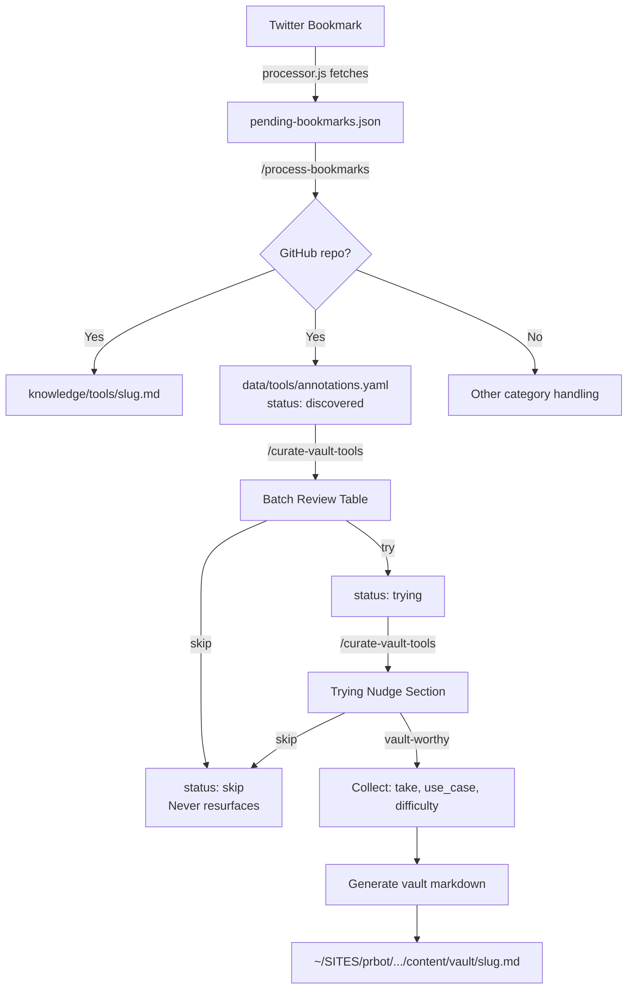

# feat: Tool Discovery Pipeline — from bookmark to vault recommendation

## Overview

Build a pipeline from tool discovery (GitHub repos bookmarked on X) through editorial curation to published vault recommendations in the House of Vibe. Tools flow through a status lifecycle (`discovered` → `trying`/`skip` → `vault-worthy`/`skip`) tracked in a YAML annotations sidecar. A new `/curate-vault-tools` slash command provides the editorial interface. Vault-worthy tools produce markdown files written directly to prbot.

## Problem Frame

Smaug already discovers tools via bookmarks and files them to `knowledge/tools/`, but there's no path from "interesting GitHub repo someone tweeted" to "tested recommendation in the House of Vibe vault." The discovery data exists; the editorial layer and publishing pipeline do not. The vault must contain authentic, human-endorsed recommendations — not auto-generated listicles. (see origin: docs/brainstorms/2026-03-25-tool-discovery-pipeline-requirements.md)

## Requirements Trace

- R1. Auto-annotate on discovery — create `discovered` entry when `process-bookmarks` files a GitHub repo
- R2. Annotations sidecar — `data/tools/annotations.yaml` tracks status, dates, sharers, editorial fields
- R3. Status lifecycle — `discovered` → `trying`|`skip`, `trying` → `vault-worthy`|`skip` with date tracking
- R4. Curation command — `/curate-vault-tools` with batch table sorted by signal strength
- R5. Trying nudge — "Currently Trying" section at top of curation view
- R6. Editorial input — collect take, use_case, difficulty when marking vault-worthy
- R7. Vault resource generation — combine knowledge file + editorial annotation into vault markdown
- R8. Direct write to prbot — output to `~/SITES/prbot/apps/startupbros/content/vault/`
- R9. Inbox compounding — skip/vault-worthy tools excluded; only discovered/trying surface during curation

## Scope Boundaries

- Tools only — articles, videos, podcasts are out of scope
- No auto-publishing — pipeline ends at writing the vault markdown file
- No GitHub API integration for live star counts — capture stars from pending JSON at discovery time
- No retroactive backfill — existing `knowledge/tools/` files don't auto-get annotations

## Context & Research

### Relevant Code and Patterns

- **`src/config.js`** — `DEFAULT_CONFIG` with deep merge pattern; new config keys follow existing conventions (add to defaults, env var overrides, tilde expansion)
- **`.claude/commands/process-bookmarks.md`** — 600-line slash command; parallel subagent processing; Edit-over-Write safety pattern; tool knowledge files created during category matching (GitHub repos → `knowledge/tools/`)
- **`knowledge/tools/*.md`** — 28 files; frontmatter: `title`, `type: tool`, `date_added`, `source`, `tags`, `via`
- **`src/processor.js` `fetchGitHubContent`** — returns `name`, `fullName`, `description`, `stars`, `language`, `topics`, `readme`, `url`; stars available in pending JSON `content` field
- **X Creator Directory precedent (prbot)** — `data/x-creators/annotations.yaml` keyed by handle; `curate-x-creators.md` command: batch table → collect input → write output; same sidecar-over-source-file architecture
- **Vault schema (`VaultFrontmatterSchema`)** — `title`, `slug`, `description`, `resource_type` (enum including `'tool'`), `entitlement`, `tags`, `is_featured`, `is_start_here`, `difficulty` (`'beginner'`|`'intermediate'`|`'advanced'`)
- **Existing vault file pattern** (`siftly-x-bookmark-tool.md`) — frontmatter + `## What It Does` + `## Who It's For` + `## Getting Started`

### Institutional Learnings

No `docs/solutions/` directory exists yet. Relevant patterns are captured above from direct codebase analysis.

## Key Technical Decisions

- **Capture stars at discovery time:** The pending JSON already contains GitHub star counts from `fetchGitHubContent`. Writing stars to the annotation during `process-bookmarks` eliminates any need for live GitHub API calls during curation. Stars may become stale, but the curation sort only needs approximate signal, not real-time accuracy.
- **Annotation keyed by slug (filename stem):** `whisper-flow` → matches `knowledge/tools/whisper-flow.md`. Slugs are already unique within the tools directory. Follows X Creator Directory's handle-keyed pattern.
- **Slash command for annotation writes, not Node.js code:** The AI already creates knowledge files during `process-bookmarks`. Adding annotation YAML writes to the command instructions keeps the integration in one place and requires no Node.js code changes for R1. The Edit tool handles YAML updates safely.
- **Single command file for full curation lifecycle:** `/curate-vault-tools` handles batch review, status transitions, editorial input, AND vault generation. Splitting into multiple commands would fragment a workflow that's designed to flow from scan → decide → publish in one session.
- **Direct cross-repo write:** Follows established Smaug → prbot pattern. No git operations from Smaug — prbot handles its own commits and sync.

## Open Questions

### Resolved During Planning

- **Star count approach (R4):** Use stars from pending JSON, captured at discovery time in annotation. No live API calls needed. Rationale: `fetchGitHubContent` already returns stars; they're available in the AI's processing context.
- **Integration point for R1:** Slash command instructions in `process-bookmarks.md`. The annotation write happens alongside knowledge file creation — same processing step, same subagent context in parallel mode. No Node.js changes needed.
- **Annotation schema design (R2):** YAML file with `tools:` top-level key, entries keyed by slug. Each entry: `knowledge_file`, `source`, `status`, dates (`discovered`, `trying`, `vault_worthy`, `skipped`), `via` (array of sharers), `stars`, editorial fields (`take`, `use_case`, `difficulty`). Schema documented in file header comment.
- **Vault template (R7):** Frontmatter from `VaultFrontmatterSchema` with `resource_type: 'tool'`, `entitlement: 'house-of-vibe'`. Body follows existing vault pattern: `## What It Does` (from knowledge file), `## Who It's For` (from editorial use_case), `## Getting Started` (links).

- **Parallel subagent annotation writes (R1):** Annotation writes must happen in the merge step (after subagents complete), not within subagents. YAML has no safe concurrent-append primitive — concurrent Edit calls on the same file would race. Subagents return annotation metadata alongside batch files; the main agent writes all annotations sequentially during merge. This is the same pattern used for bookmarks.md merge.

### Deferred to Implementation

- **YAML formatting edge cases:** Exact quoting rules for `take` field values containing colons or special characters — the AI will handle this naturally with YAML conventions.
- **Batch table column widths:** Exact table formatting for the curation display — depends on terminal width and content length. Implementer should test with real data.

## High-Level Technical Design

> *This illustrates the intended approach and is directional guidance for review, not implementation specification. The implementing agent should treat it as context, not code to reproduce.*



**Annotations YAML structure:**
```yaml
# Tool Discovery Annotations — Editorial Source of Truth
# Keyed by slug (matches knowledge/tools/{slug}.md)
# Status lifecycle: discovered → trying | skip, trying → vault-worthy | skip
tools:
  whisper-flow:
    knowledge_file: knowledge/tools/whisper-flow.md
    source: "https://github.com/dimastatz/whisper-flow"
    status: discovered
    discovered: 2026-01-02
    via:
      - "@tom_doerr"
    stars: 1234
    # Editorial fields (populated when vault-worthy):
    # take: "one-liner authentic opinion"
    # use_case: "who it's for / when to use it"
    # difficulty: beginner | intermediate | advanced
```

## Implementation Units

- [ ] **Unit 1: Annotation infrastructure & config**

  **Goal:** Create the annotations YAML file with schema documentation and add configurable paths to the config system.

  **Requirements:** R2 (annotations sidecar foundation)

  **Dependencies:** None

  **Files:**
  - Create: `data/tools/annotations.yaml`
  - Modify: `src/config.js`
  - Test: `test/config.test.js`

  **Approach:**
  - Create `data/tools/annotations.yaml` with a commented header documenting the schema (status values, field meanings, lifecycle) and an empty `tools:` key. Follow the X Creator Directory's `data/x-creators/annotations.yaml` header pattern.
  - Add two config keys to `DEFAULT_CONFIG` in `src/config.js`:
    - `annotationsFile: './data/tools/annotations.yaml'` — path to annotations sidecar
    - `vaultOutputDir: '~/SITES/prbot/apps/startupbros/content/vault'` — cross-repo output path
  - Add env var overrides: `ANNOTATIONS_FILE`, `VAULT_OUTPUT_DIR`
  - Add tilde expansion for both paths in the config loader
  - Keep `data/tools/` tracked in git (not gitignored)

  **Patterns to follow:**
  - `src/config.js` `DEFAULT_CONFIG` key pattern and env var override pattern
  - `data/x-creators/annotations.yaml` header comment style (prbot)
  - Tilde expansion block at bottom of `loadConfig`

  **Test scenarios:**
  - Config loads with default `annotationsFile` and `vaultOutputDir` values
  - Env vars `ANNOTATIONS_FILE` and `VAULT_OUTPUT_DIR` override defaults
  - Tilde expansion works for both new paths

  **Verification:**
  - `data/tools/annotations.yaml` exists with schema header and empty `tools:` key
  - `loadConfig()` returns the new keys with correct defaults
  - All existing tests still pass

- [ ] **Unit 2: Auto-annotate on discovery**

  **Goal:** When `process-bookmarks` files a GitHub repo to `knowledge/tools/`, simultaneously create a `discovered` annotation entry capturing the tool's metadata and star count.

  **Requirements:** R1, R2

  **Dependencies:** Unit 1 (annotations file and config keys must exist)

  **Files:**
  - Modify: `.claude/commands/process-bookmarks.md`

  **Approach:**
  - Add a new section to `process-bookmarks.md` instructions: "Annotation Write for GitHub Tools"
  - After creating a knowledge file in `knowledge/tools/{slug}.md`, also write/update `data/tools/annotations.yaml` using the Edit tool
  - Extract from the pending JSON content: `source` (GitHub URL), `stars`, `via` (tweet author)
  - Write the annotation entry with: `knowledge_file`, `source`, `status: discovered`, `discovered: {today}`, `via: ["@{author}"]`, `stars`
  - **For parallel processing:** Annotation writes happen in the merge step (after subagents complete), not within subagents — YAML has no safe concurrent-append primitive (see resolved Open Question). Subagents return annotation metadata alongside batch files. The main agent reads knowledge files created by subagents and writes all annotations in one sequential pass.
  - **Dedup rule:** If the slug already exists in annotations, do NOT overwrite — but DO append new sharers to the `via` array (handles the case where multiple people share the same tool)
  - Use Edit tool for YAML updates (same safety principle as bookmarks.md)

  **Patterns to follow:**
  - Existing knowledge file creation flow in `process-bookmarks.md` (lines around category matching)
  - Edit-over-Write safety pattern already established in the command
  - Parallel processing batch-file pattern for deferring writes to merge step

  **Test scenarios:**
  - New GitHub repo bookmark → annotation entry created with correct fields
  - Existing tool re-shared by different user → `via` array updated, status preserved
  - Non-GitHub bookmark → no annotation written
  - Parallel batch of 3 GitHub repos → all 3 annotations written correctly during merge
  - Stars field populated from pending JSON content

  **Verification:**
  - After running `/process-bookmarks` with a GitHub repo bookmark, `data/tools/annotations.yaml` contains a new entry with status `discovered`, correct slug, source URL, star count, and sharer
  - Existing annotations are not corrupted by the update

- [ ] **Unit 3: Curation command — batch review & status management**

  **Goal:** Create the `/curate-vault-tools` slash command that surfaces tools needing attention in a scannable batch table, with status transition support for try/skip decisions.

  **Requirements:** R3, R4, R5, R9

  **Dependencies:** Unit 1 (annotations file), Unit 2 (populated annotations)

  **Files:**
  - Create: `.claude/commands/curate-vault-tools.md`

  **Approach:**
  - Command structure follows the `curate-x-creators.md` pattern: Setup → Read → Present → Collect → Write → Report
  - **Setup phase:** Read `data/tools/annotations.yaml` (path from config) and filter to actionable tools (`discovered` + `trying`). Also read each tool's knowledge file to extract the one-line description for the table. If a knowledge file referenced in an annotation is missing, show the tool with a `[knowledge file missing]` warning instead of erroring — the annotation still has source URL and metadata.
  - **"Currently Trying" nudge (R5):** Present `trying` tools first in a separate section at the top. Show tool name, how long it's been in `trying` (days since `trying` date), and the original discovery context. Prompt: "Still trying these — ready to evaluate any?"
  - **Batch discovery table (R4):** Present `discovered` tools in a table sorted by signal strength:
    1. Multiple sharers (via array length > 1) — highest signal
    2. Star count (descending) — secondary signal
    3. Recency (discovered date, newest first) — tertiary signal
  - Table columns: `#`, `Tool`, `Stars`, `Sharers`, `Discovered`, `Source`
  - For each tool, show enough context to make a try/skip decision in seconds: name, star count, sharer(s), discovery date, and a 1-line description pulled from the knowledge file
  - **Per-tool interaction (modeled on curate-x-creators.md):** After presenting the table, show action options for each tool:
    - `skip` — mark and move to next
    - `try` — mark as trying and move to next
    - `vault-worthy` — enter editorial input flow (Unit 4)
    - `open` — show full knowledge file context for deeper review before deciding
  - **Bulk operations:** Accept comma-separated numbers for bulk skip (e.g., "skip 1,3,5,7") or "skip all" for remaining discovered tools. After each batch of decisions: "Continue with next batch, or stop here?"
  - **Status transitions (R3):**
    - `skip` — set `status: skip`, `skipped: {today}`. Tool never resurfaces (R9).
    - `try` — set `status: trying`, `trying: {today}`. Tool moves to the trying nudge section.
    - `vault-worthy` — hand off to the vault-worthy flow (Unit 4)
  - **Write phase:** Update annotations.yaml with all status changes using Edit tool. Never modify existing `skip` or `vault-worthy` entries unless explicitly asked.
  - **Inbox compounding (R9):** Only `discovered` and `trying` tools appear. `skip` and `vault-worthy` are filtered out at read time.
  - **Empty state:** If no actionable tools exist, report "No tools to review — all discovered tools have been evaluated" and exit cleanly.
  - **Malformed YAML recovery:** If annotations.yaml fails to parse, warn the user and offer to back up the file and recreate from scratch (following curate-x-creators.md error handling pattern).

  **Patterns to follow:**
  - `curate-x-creators.md` command structure (prbot) — batch table presentation, collect-then-write flow
  - `process-bookmarks.md` — Edit tool safety, config loading, multi-phase structure
  - Slash command frontmatter: `description` and optional `argument-hint`

  **Test scenarios:**
  - Empty annotations → command reports "No tools to review" and exits cleanly
  - Mix of discovered/trying/skip/vault-worthy → only discovered and trying shown
  - Trying tools appear in dedicated section above discovery table with days-since-trying count
  - Table sort order: multi-sharer tool above high-star single-sharer tool
  - Bulk skip with "skip 1,3,5" updates all three entries correctly in one pass
  - "skip all" marks all remaining discovered tools as skipped
  - Re-running after decisions → skipped tools don't reappear
  - Knowledge file missing for an annotated tool → tool shown with warning, not a crash
  - Malformed annotations.yaml → backup offered, not silent corruption
  - `open` action shows full knowledge file before returning to action options

  **Verification:**
  - Running `/curate-vault-tools` with populated annotations shows a formatted batch table
  - Status transitions are persisted to annotations.yaml with correct dates
  - Skipped and vault-worthy tools never appear in subsequent curation runs
  - Graceful degradation when knowledge files are missing or annotations are malformed

- [ ] **Unit 4: Editorial input & vault resource generation**

  **Goal:** When marking a tool `vault-worthy`, collect editorial input and generate a vault markdown file written directly to the prbot content directory.

  **Requirements:** R6, R7, R8

  **Dependencies:** Unit 3 (curation command with status transition flow)

  **Files:**
  - Modify: `.claude/commands/curate-vault-tools.md`

  **Approach:**
  - **Editorial input (R6):** When user selects `vault-worthy` for a tool, prompt for three fields:
    1. **Take** — one-liner authentic opinion (free text, the user's genuine reaction)
    2. **Use case** — who it's for and when to use it (House of Vibe audience framing)
    3. **Difficulty** — `beginner`, `intermediate`, or `advanced`
  - Store editorial fields in the annotation entry: `take`, `use_case`, `difficulty`
  - Set `status: vault-worthy`, `vault_worthy: {today}`
  - **Vault resource generation (R7):** Combine data from two sources:
    - Knowledge file (`knowledge/tools/{slug}.md`): title, description, key features, links, tags
    - Annotation: take, use_case, difficulty, source URL
  - Generate vault markdown with `VaultFrontmatterSchema`-compliant frontmatter:
    - `title`: from knowledge file
    - `slug`: from annotation key (the tool slug)
    - `description`: from knowledge file description or editorial take
    - `resource_type: 'tool'`
    - `entitlement: 'house-of-vibe'`
    - `tags`: from knowledge file tags
    - `is_featured: false`
    - `is_start_here: false`
    - `difficulty`: from editorial input
  - Body structure (following existing vault pattern):
    - `## What It Does` — description and key features from knowledge file
    - `## Who It's For` — editorial use_case
    - `## Getting Started` — links (GitHub, homepage if available)
    - Author's take woven into the description naturally, not as a separate callout
  - **Direct write to prbot (R8):** Write the generated file to `{vaultOutputDir}/{slug}.md` using the Write tool (new file, not editing existing). The `vaultOutputDir` path comes from config (default: `~/SITES/prbot/apps/startupbros/content/vault`).
  - Report the written file path and remind user to commit in prbot separately.

  **Patterns to follow:**
  - `VaultFrontmatterSchema` field constraints (prbot `content-sync.ts`)
  - Existing vault file `siftly-x-bookmark-tool.md` body structure
  - Cross-repo write pattern — Smaug writes, prbot handles sync

  **Test scenarios:**
  - Vault-worthy flow collects all three editorial fields before generating
  - Generated frontmatter validates against `VaultFrontmatterSchema` (correct field names, types, enums)
  - Slug with special characters is properly kebab-cased
  - Knowledge file with minimal content still produces a valid vault file
  - File written to correct prbot path with correct filename
  - Annotation updated with editorial fields and vault-worthy status + date

  **Verification:**
  - After marking a tool vault-worthy and providing editorial input, a valid vault markdown file exists at `~/SITES/prbot/apps/startupbros/content/vault/{slug}.md`
  - The vault file's frontmatter matches `VaultFrontmatterSchema` requirements
  - The annotation entry shows `status: vault-worthy` with all editorial fields populated
  - The tool no longer appears in subsequent `/curate-vault-tools` runs

## System-Wide Impact

- **Interaction graph:** `process-bookmarks.md` gains a new side effect (annotation write during merge step). The parallel subagent protocol must account for deferred annotation writes — subagents return metadata, main agent writes annotations sequentially after all batches complete. The new `/curate-vault-tools` command is independent — triggered manually, no callbacks or observers.
- **Error propagation:** If annotation write fails during `process-bookmarks`, the knowledge file still gets created (the primary artifact). An orphaned knowledge file without annotation is harmless — it just won't appear in curation. If vault file write fails (e.g., prbot directory missing), the annotation should still be updated to vault-worthy so the user can re-generate later.
- **State lifecycle risks:** `process-bookmarks` has no file-level locking on annotations.yaml. Concurrent runs are prevented at the scheduling layer (`job.js` runs one invocation at a time via sequential `execFile` calls), not by the command itself. If the user manually runs `/process-bookmarks` while a scheduled job is active, both could write to annotations.yaml. Mitigation: annotation writes use the Edit tool (string replacement), and each entry is keyed by unique slug — concurrent writes to *different* slugs are safe. Concurrent writes to the *same* slug (re-shared tool) could conflict, but this is rare and the worst case is a missed `via` entry, not data corruption. The `curate-vault-tools` command is interactive and single-session by nature.
- **Reference integrity:** Annotations reference knowledge files by path (`knowledge_file` field). If a knowledge file is renamed, moved, or deleted, the annotation becomes an orphan with a broken reference. The curation command must handle this gracefully — show the tool with available annotation metadata and a warning, not crash. Knowledge file deletion is rare (files are append-only artifacts) but renaming during cleanup is plausible.
- **API surface parity:** No external API surface affected. This is a CLI tool with slash commands.
- **Integration coverage:** End-to-end flow from bookmark → annotation → curation → vault file should be validated manually with a real tool discovery cycle. The individual units can be verified independently.

## Risks & Dependencies

- **prbot vault directory must exist:** The write to `~/SITES/prbot/apps/startupbros/content/vault/` assumes the directory exists. If prbot isn't cloned locally, the vault write will fail. **Mitigation:** The curation command should check for the directory at startup (before any editorial input) and warn early with the expected path, so the user doesn't waste time on editorial input that can't be saved.
- **VaultFrontmatterSchema stability:** The plan assumes the current schema fields are stable. If prbot changes the schema, the vault template in the curation command will need updating. This is low risk — the schema has been stable.
- **YAML editing reliability:** The AI edits YAML via the Edit tool, which does string replacement. Malformed YAML could result from incorrect edits. **Mitigation:** The schema header comment serves as a reference; the simple flat structure (one level of nesting) minimizes risk. The curation command includes a malformed-YAML recovery path: warn, offer backup, recreate from scratch. This mirrors the curate-x-creators.md error handling pattern.
- **Orphaned annotation references:** If a knowledge file is deleted or renamed after its annotation is created, the `knowledge_file` path in the annotation becomes stale. **Mitigation:** The curation command treats missing knowledge files as a warning, not an error — it shows the tool with available annotation data (source URL, stars, sharers) and flags `[knowledge file missing]`. This is a soft degradation, not a blocker.
- **Slash command length:** `curate-vault-tools.md` will be a substantial command (~300-400 lines) covering batch review + editorial input + vault generation. This follows the existing `process-bookmarks.md` precedent (600 lines).

## Sources & References

- **Origin document:** [docs/brainstorms/2026-03-25-tool-discovery-pipeline-requirements.md](docs/brainstorms/2026-03-25-tool-discovery-pipeline-requirements.md)
- Related code: `src/config.js`, `.claude/commands/process-bookmarks.md`, `src/processor.js` (`fetchGitHubContent`)
- Precedent: X Creator Directory in prbot (`data/x-creators/annotations.yaml`, `.claude/commands/curate-x-creators.md`)
- Vault schema: `~/SITES/prbot/apps/startupbros/scripts/content-sync.ts` (`VaultFrontmatterSchema`)
- Vault example: `~/SITES/prbot/apps/startupbros/content/vault/siftly-x-bookmark-tool.md`
